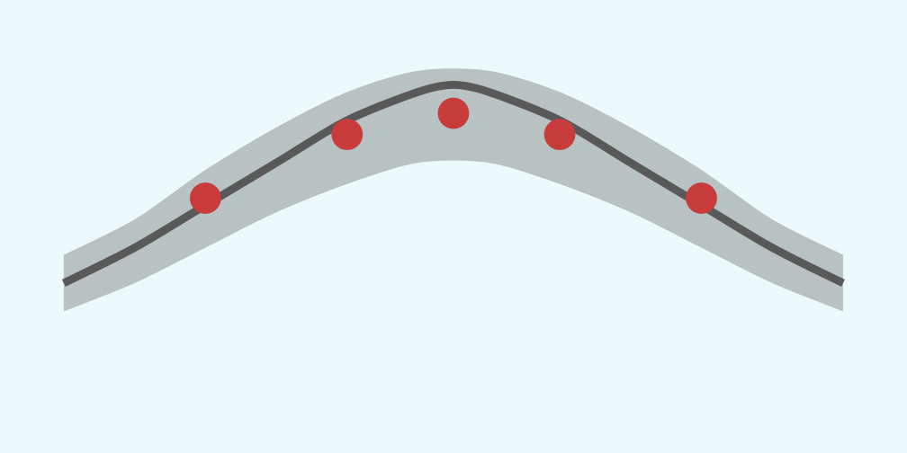
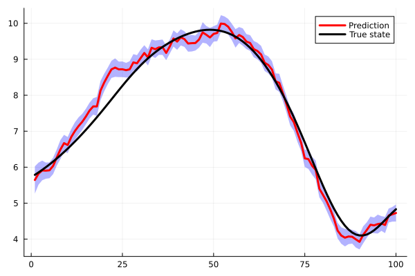

# MeteoModels



> **Note**
>  
> Despite the code being public, the package is not yet finalised and is still under active development.  
> It is not currently available through Julia’s General registry.


This package provides a collection of tools for **data assimilation** and **uncertainty quantification** in real-world dynamical systems, with a particular focus on geophysical and weather-related processes.
The final version of the package is expected to support (at least!) the following functionalities:

* **Kalman Filter (KF)**: an algorithm that produces estimates of unknown state variables using a sequence of noisy measurements observed over time. At each time step, the filter outputs a probability distribution over the state variables. `(AVAILABLE)`
* **Extended Kalman Filter (EKF)**: a nonlinear extension of the KF that linearises the transition and/or observation operators around the current estimates of the mean and covariance at each time step. `(AVAILABLE)`
* **Unscented Kalman Filter (UKF)**: another nonlinear extension of the KF which avoids explicit linearisation (as in the EKF, which can be computationally expensive and may incur significant accuracy loss). Instead, it approximates the propagation of uncertainty by interpolating the probability distribution through a carefully chosen set of interpolation (sigma) points. `(AVAILABLE)`
* **Ensemble Kalman Filter (EnKF)**: a Monte Carlo–based approximation of the KF in which the covariance matrices are estimated from an ensemble of state realisations at each time step. Rather than propagating a single probability distribution, the method evolves an ensemble and interprets the sample spread as a measure of uncertainty. `(AVAILABLE)`
* **Deterministic Ensemble Kalman Filter (DEnKF)**: a deterministic ensemble-based filtering method that avoids the use of perturbed observations and reduces sampling noise compared to the standard EnKF, thereby helping to mitigate ensemble collapse. `(AVAILABLE)`
* **Reduced-basis Ensemble Kalman Filter (RB-EnKF)**: a reduced-order variant of the EnKF that lowers computational cost by employing projection-based operators to reduce the dimensionality of the state space, making the method suitable for large-scale problems. `(NOT YET AVAILABLE)`

| **Documentation** |
|:------------ |
| [](https://nichomueller.github.io/MeteoModels.jl/dev/) |

| **Build Status** |
|:------------|
| [](https://github.com/nichomueller/MeteoModels.jl/actions/workflows/ci.yml) [](https://codecov.io/gh/nichomueller/MeteoModels.jl) |

## Installation 

The package cannot yet be installed, as it is not yet available to Julia's general register. Once this is done, it may be loaded via the following command:

```julia
# Type ] to enter package mode
pkg> add MeteoModels
```

## Quick start 

A minimal Kalman Filter setup consists of:
* a transition model;
* an observation model;
* a prior probability distribution on the state;

```julia
using MeteoModels
using LinearAlgebra

# Dimensions
n = 3
m = 1

# Prior
μ = [1.0,1.0,1.0]
Σ = I(n)
prior = SecondMoment(μ,Σ)

# Transition and observation models
transition = Model(I(n))
observation = Model([1 0 0])

# Kalman filter
kf = KalmanFilter(transition,observation,prior)
```

Given a sequence of observations, the filter can be run as:

```julia
results = loop(kf,observations)
```

See the tutorials for complete, reproducible examples.

## Tutorials 

The `docs/` directory contains detailed tutorials illustrating the use of the package in realistic benchmarks, including:

* Kalman Filter, EKF, and UKF on a linear and nonlinear kinematic model;
* EnKF applied to a rainfall–runoff problem;
* EnKF applied to the chaotic Lorenz-96 system.



Each tutorial is written to emphasize:

* correct probabilistic modeling,
* ensemble initialization and inflation strategies,
* interpretation of uncertainty and filter diagnostics.