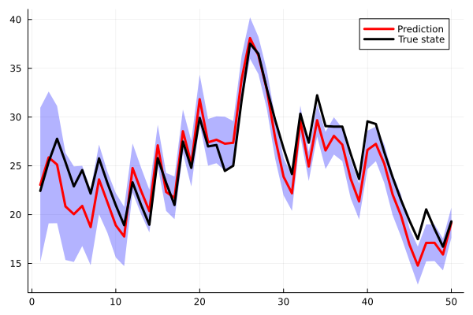

# Usage - Ensemble Kalman Filter (EnKF)

In this tutorial, we show how to employ the EnKF method in two separate applications: the [rainfall–runoff](https://towardsdatascience.com/addressing-the-butterfly-effect-data-assimilation-using-ensemble-kalman-filter-9883d0e1197b/) problem, as well as the notoriously difficult (nonlinear) [Lorenz–96](https://en.wikipedia.org/wiki/Lorenz_96_model) benchmark.

## Rainfall-runoff modeling

We start by loading the relevant packages:

```julia
using MeteoModels
using Distributions
using LinearAlgebra
```

We begin by defining the relevant sizes for this problem: 

```julia
n = 3 # state size 
m = 1 # observation size 
nt = 50 # number of time-steps 
ne = 30 # ensemble size 
```

We now (randomly) generate the rainfall data and evaporation coefficients needed to define the transition and observation operators. To make this benchmark more realistic, we make the following distinctions:
* **true** vs **model** transition operators: the true transition governs the evolution of the actual system, whereas the model transition is the one used inside the EnKF and is characterized by model errors;
* **true** vs **model** observation operators: the observations fed to the EnKF are generated through the true observation model and include measurement noise, while the model observation operator is the one used internally by the EnKF.

We start by defining the true operators, which we immediately use to generate the exact state variable (the unknown of the problem) as well as the observations obtained through the true observation model:

```julia
rainfall = clamp.(rand(Uniform(0,20),(n,nt)) .- 10.0,0.0,10.0)
evapcoef = repeat(rand(Uniform(0.05,0.1),(n,));outer=(1,nt))

function true_transition(states,θ)
  rainfall,evapcoef = θ
  x = states + rainfall - evapcoef.*states 
  map(x -> clamp(x,0.0,50.0),x)
end

function true_observation(states)
  θ = draw(obs_noise)
  y = sum(sqrt.(map(x -> clamp(x,0.0,50.0),states)))
  θ .+ y
end

true_x = rand(Uniform(20,40),n)
true_data = zeros(n,nt)
true_obs = zeros(m,nt)

@views for k in 1:nt 
  θ = (rainfall[:,k],evapcoef[:,k])
  true_x = true_transition(true_x,θ)
  true_data[:,k] = copy(true_x)
  true_obs[:,k] .= true_observation(true_x)
end
```

We can now define the probability distributions associated with the observation noise:

```julia 
R = 0.5^2 * I(m) # observation noise covariance 
obs_noise = Noise(R) # observation noise distribution
```

Recall that, in the EnKF, the state covariance is not explicitly computed—this is precisely the motivation for using the EnKF instead of the standard KF. A natural question then arises: since `proc_noise` is a random variable with zero mean (and nonzero covariance), and since EnKF does not explicitly compute covariances, is the process noise actually accounted for?

The answer is **yes**. During the forecast step, we rely on additive inflation, which prevents the ensemble spread from collapsing. To enable this behavior, we simply use the keyword `Additive()` when defining the transition model.

```julia
function transition_function(k::Int)
  function f(states)
    x = 1.01 .* states.^0.99 .+ 1.02 .* rainfall[:,k] .- evapcoef[:,k].*states 
    map(x -> clamp(x,0.0,50.0),x)
  end
  return f 
end

function observation_function(k::Int)
  function f(states)
    sum(sqrt.(map(x -> clamp(x,0.0,50.0),states)))
  end
  return f 
end

# transition model 
transition = k -> Model(transition_function(k);strategy=Additive())
# observation model 
observation = k -> Model(observation_function(k))
```

Note that, in this case, the transition and observation models are functions rather than [`Model`](@ref). Although slightly less conventional, this is perfectly valid syntax in this package. The only difference is that a transition and observation model must be obtained by evaluating `transition` and `observation`, respectively, at each iteration.

We can now define the EnKF using the usual syntax:

```julia
ensemble = rand(Uniform(10,50),(n,ne))
prior = Ensemble(ensemble)
enkf = KalmanFilter(transition,observation,prior;obs_noise)
```

An `Ensemble`, in this package, is a [`SecondMoment`](@ref) distribution. Please refer to the [`Ensemble`](@ref) documentation for more details. We simply remark here that it is also possible to employ the DEnKF methodology, which does not rely on additive inflation (and may therefore be more accurate), at the cost of a slightly more expensive analysis step. To do so, one can use the following syntax:

```julia
transition = k -> Model(transition_function(k))
prior = Ensemble(ensemble;strategy=DEnKFStrategy())
```

As usual, we run the iterations and assess the performance of the EnKF with respect to the true data:

```julia
history = loop(enkf,true_obs)
visualise(true_data,history)
```



## Lorenz-96 system 

In this tutorial, we solve the Lorenz–96 system, which roughly models the evolution of an unspecified scalar meteorological quantity (such as temperature or vorticity) along a latitude circle. The system consists of 40 coupled ordinary differential equations defined on a domain with cyclic boundary conditions:

```math
\begin{aligned}
\dot{\bm{y}}_{i} &= (\bm{y}_{i+1} - \bm{y}_{i-2})\,\bm{y}_{i-1} + 8,
\qquad i = 1,\dots,40, \\
\bm{y}_{0} &= \bm{y}_{40}, \\
\bm{y}_{-1} &= \bm{y}_{39}, \\
\bm{y}_{41} &= \bm{y}_{1}.
\end{aligned}
```

We consider:
* a time step `dt = 0.01` and a window of `100` time steps;
* a spinoff of one thousand iterations (``t = 0,...,999dt``), after which the true data are generated by integrating the Lorenz equations over the time window (``t = 1000dt,...,1099dt``);
* an initial ensemble generated by adding zero-mean, unit-variance Gaussian perturbations to the true initial condition;
* an observation operator that records every second state variable;
* n addition to the additive inflation used in the previous tutorial, a multiplicative inflation applied to the observation covariance (which, unlike the transition covariance, is updated).

We now set up the problem by loading the relevant packages:

```julia
using MeteoModels
using Distributions
using LinearAlgebra
```

We define the problem sizes:

```julia
n = 40 # state size 
m = 1 # observation size 
nt = 100 # number of time-steps 
ne = 50 # ensemble size 
```

We define the transition and observation processes for this problem:

```julia
# Observation operator (observe every 2nd variable)
H = zeros(Int,m,n)
for i in 1:m
  H[i,2*i-1] = 1
end

function true_observationf(x::AbstractVector)
  y = H * x
  y + draw(obs_noise)
end

function observationf(x)
  H * x
end

function lorenz96!(dx::AbstractVector,x::AbstractVector)
  n = length(x)
  @inbounds for i in 1:n
    dx[i] = (x[mod1(i+1,n)] - x[mod1(i-2,n)]) * x[mod1(i-1,n)] - x[i] + 8
  end
  return dx
end

dx = zeros(n) # cache 
dxe = zeros(n,ne) # cache ensemble 

function transitionf(x::AbstractVector)
  lorenz96!(dx,x) 
  x + dt * dx 
end

function transitionf(x::AbstractMatrix)
  lorenz96!(dxe,x) 
  x + dt * dxe 
end
```

We may collect the true data and the observations:

```julia
xtrue = repeat(xtrue0;outer=(1,nt+1))
obs = zeros(m,nt)
for k in 1:nt
  xtrue[:,k+1] = transitionf(xtrue[:,k])
  obs[:,k] = true_observationf(xtrue[:,k+1])
end
xtrue = xtrue[:,2:end]
```

We now define the transition operator with additive inflation and the observation operator with multiplicative inflation:

```julia
ρ = 1.1 # multiplicative inflation 
obs_noise = Noise(R)

transition = Model(transitionf;strategy=Additive())
observation = Model(observationf;strategy=Multiplicative(ρ))
```

Finally, we run the EnKF procedure:

```julia
ensemble = rand(Normal(0,1),n,ne) + xtrue0*ones(1,ne)
prior = Ensemble(ensemble)
enkf = KalmanFilter(transition,observation,prior)

history = loop(enkf,obs)
visualise(xtrue,history)
```

