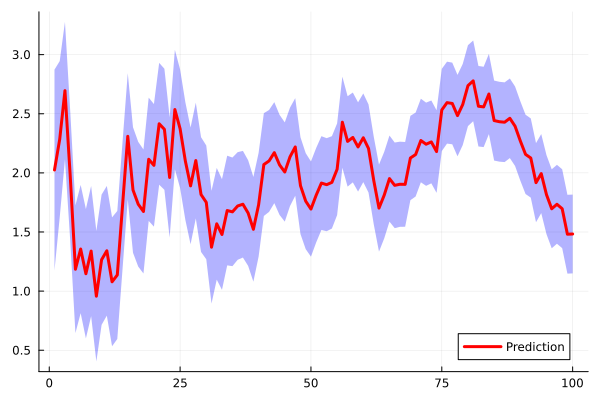

# Usage - Kalman Filter (KF)

In this tutorial, we demonstrate how to use the Kalman Filter (KF) method on a simple mock benchmark. We also illustrate how to employ its nonlinear variants, namely the Extended Kalman Filter (EKF) and the Unscented Kalman Filter (UKF).

## Standard KF

We begin by considering a very simple linear mock benchmark — representing a kinematic model — as our first test case for the KF algorithm. To correctly define and run an iterative KF procedure, we first need to specify the following quantities:

* a transition model: a map from the state space to itself, i.e.

```math
\mathcal{F}: \R^{n} \to \R^{n},
```

and possibly characterized by a stochastic noise component, which is used to propagate the state from one iteration to the next. Here, ``n`` denotes the dimension of the state space;

* an observation model: a map from the state space to an observation space, i.e.

```math
\mathcal{O}: \R^{n} \to \R^{m},
```

and possibly characterized by a stochastic noise component, which is used to estimate the observation at each iteration. Here, ``m`` denotes the dimension of the observation space;
* a prior distribution

```math
\text{prior} \sim \mathcal{P}(\bm{\mu},\bm{P}), \quad \bm{\mu} \in \R^{n}, \quad \bm{P} \in \R^{n} \times \R^{n}
```

defined on the state space.

Optionally, we may also provide a prior distribution for the observations. By default, the distribution

```math
\text{obs\_prior} \sim \mathcal{P}(\bm{\eta},\bm{T}), \quad \bm{\eta} \in \R^{m}, \quad \bm{T} \in \R^{m} \times \R^{m}.
```

is assumed. However, it is not strictly necessary to explicitly define `obs_prior` in order to implement the KF steps, since it is typically defined as

```math
\text{obs\_prior} = \mathcal{O}(\text{prior}). 
```  

We now show how the scheme outlined above can be implemented in practice. We start by defining the transition and observation models:

```julia
n = 3
m = 1

# Transition model (Kinematic model)
δ = 0.1
σ_acc_noise = 0.02 
Q = [δ^2/2; δ; 1] * [δ^2/2 δ 1] * σ_acc_noise^2
proc_noise = SecondMoment(zeros(n),Q)
# Define a stochastic, linear model
transition = Model([1 δ δ^2/2; 0 1 δ; 0 0 1]) 

# Observation model (observe only the first variable)
σ_obs_noise = 1.0
R = σ_obs_noise^2 * I(m)
obs_noise = Noise(R)
# Define a stochastic, linear model
observation = Model([1 0 0],obs_noise) 
```

Introduce the initial state ``x`` and covariances ``P``:

```julia
x = [1.0, 1.0, 1.0]
P = [2.5 0.25 0.1; 0.25 2.5 0.2; 0.1 0.2 2.5]
prior = SecondMoment(x,P)
```

Now we employ the standard syntax to define our KF:

```julia
# Define filter  
kf = KalmanFilter(transition,observation,prior)
```

This object is a [`KalmanFilter`](@ref), which encapsulates all the structures required to implement the basic KF functionality. To run the KF iterations, we simply need to provide the filter `kf` with a sequence of observations (scalar-valued in this example). Since this is a mock benchmark, we generate synthetic observations by sampling random values around a prescribed mean:

```julia
nt = 100 # number of times 
obs = 2.0 .+ randn(nt) # random observations
```

Finally, we run the filter, and visualise the results:

```julia
history = loop(kf,obs)
visualise(history)
```



## Extended Kalman Filter (EKF)
The EKF is a variant of the KF obtained by linearizing nonlinear transition and/or observation operators. As an example, let us consider the following nonlinear models:

```julia
# Nonlinear transition and observation models
f(x) = x.^2
flin = LinearisedModel(f,(n,n))
transition = Model(f,proc_noise) 

h(x) = [sum(x)]
flin = LinearisedModel(h,(m,n))
observation = Model(h,obs_noise) 
```

The [`LinearisedModel`](@ref) takes as input a (generally nonlinear) function, together with a pair of integers specifying the dimension and codimension of the operator. Aside from the definitions above, the EKF tutorial proceeds in exactly the same way as the standard KF.

## Unscented Kalman Filter (UKF)

Analogously to the EKF, the UKF is a nonlinear extension of the KF. However, instead of relying on local linearization, it handles nonlinearities by propagating a set of carefully chosen interpolation points (the so-called sigma points) through the nonlinear operators. The mean and covariance of the transformed distribution are then approximated as weighted combinations of these propagated points.

In this case, the syntax is even simpler. Compared to a standard KF procedure, we only need to define an appropriate prior probability distribution:

```julia
prior = SigmaPoints(SecondMoment(x,P))
```

The remaining lines of code are analogous to those shown for the standard KF.